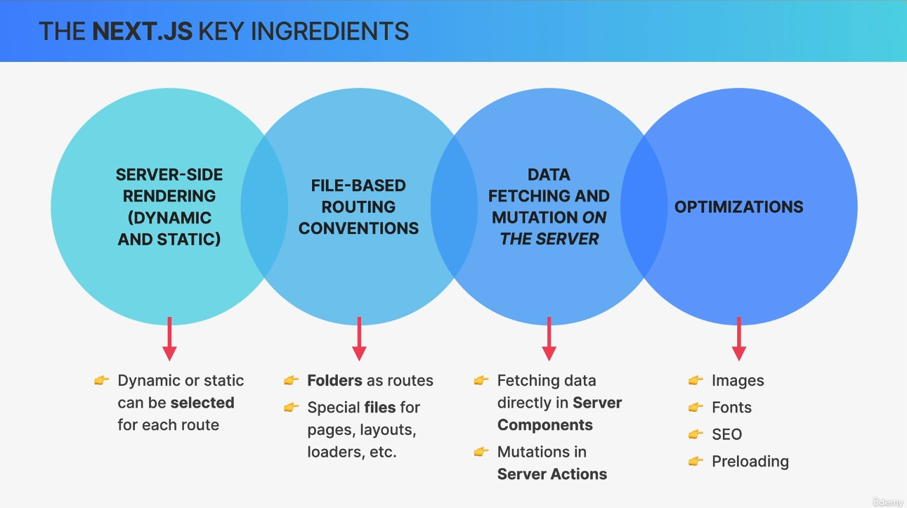
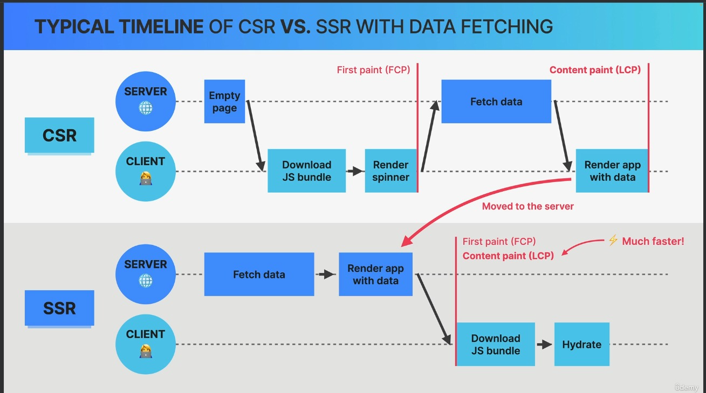
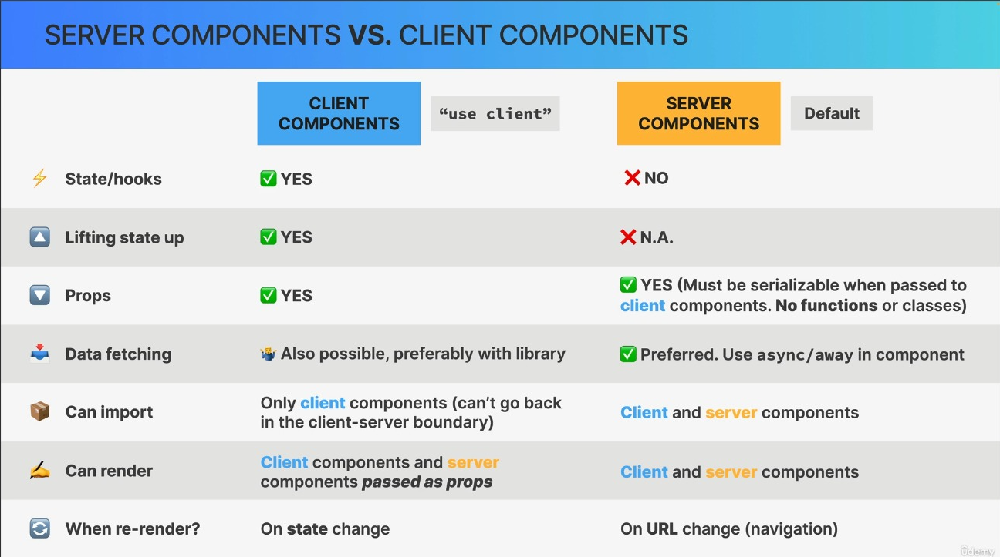
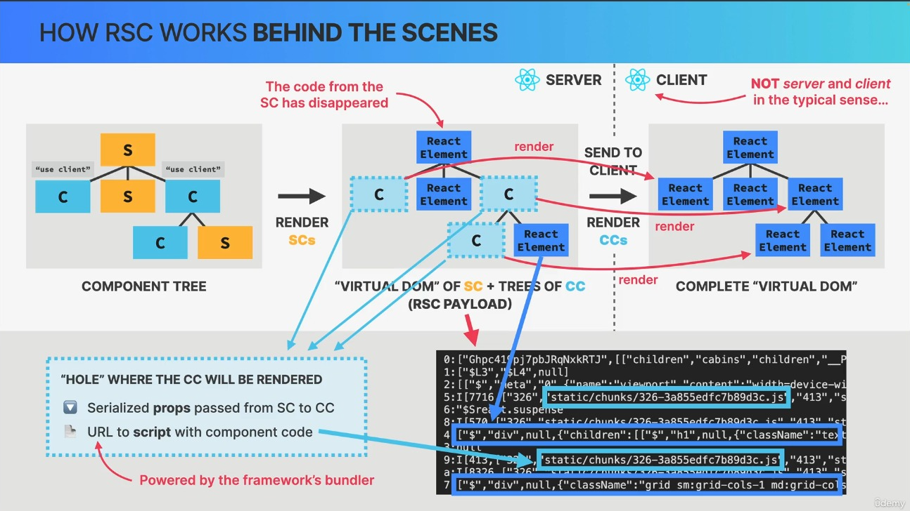

## What is NextJS ?

It is a React framework and usd to create web applications.

It was introduced because of some inconviniences in React
1.  In a React project, you have to maintain a separate Backend projects for your API routes.

2.  React does not provide out of the box routing (you have to use react-router-dom)

3.  React is **not SEO optimized**

4.  Waterfalling problem 
    when we access any page then we get all the components like, css, js html separately one after another, we can see this in network tab

### What NextJs ofers ?

1.  Server Side Rendering - Get's rid of SEO problems

2.  API routes - Single cdebase with frontend and backend

3.  File based routing (no need for react-router-dom)

4.  Bundle size optimization, static site generation

5.  Gives features like: Suspense, Server Components, Server Actions, streaming etc

6.  Maintained by the Vercel team





**Downsides :**

1.  Can't be distributed via a CDN, always needs a server running that does `server side rendering` and hence is expensive

2.  Very opinionated


---

### CSR vs SSR


| Feature                   | Client Side Rendering (CSR)                          | Server Side Rendering (SSR)                          |
|---------------------------|------------------------------------------------------|------------------------------------------------------|
| **Rendering**             | HTML is **rendered on the client** using JavaScript  | HTML is **rendered on the server**                   |
| **Initial Page Load Speed** | **Slower initial page loads**                            | **Faster initial page loads**                            |
|                           | - Bigger JavaScript bundle needs to be downloaded before app starts running | - Less JavaScript needs to be downloaded and executed |
|                           | - Data is fetched after components mount             | - Data is fetched before HTML is rendered             |
| **SEO Optimization**      | Not SEO optimized                                    | SEO friendly: Content is easier for search engines to index |


Two types of SSR:

1.  **Static :**

    HTML is generated at build time (often called Static Site Generation)

2.  **Dynamic :**

    HTML is generated each time server receives a new Request





---

### Hydration

When a React app is server side rendered, then the html which is generated is only the markup and does not have interactivity, i.e, like the event handlers which are attached to buttons are not there. This is solved by Hydration.

Hydration is the process of **transforming pre-rendered server-side** content **into an interactive user interface** on the client side.

How Hydration Works ?

1.  **Server-Side Rendering (SSR) :** 

    Next.js renders React components on the server in response to user requests, incorporating available data at that instance. This yields a fully rendered HTML page inclusive of server-derived state and data.

2.  **Send HTML to the Client :**

    Next.js transmits this fully rendered HTML page to the client's browser as the primary response. The HTML content encapsulates the static representation of the page.

3.  **Execution of Client-Side JavaScript :**

    Upon receiving the HTML, the client's browser commences executing the JavaScript bundles embedded within the page. These bundles reconstruct React components on the client side utilizing the same virtual DOM used on the server.


4.**Comparison and Reconciliation :**

    During rehydration, React on the client compares the server-rendered virtual DOM with its client-side counterpart, a process termed "reconciliation." React then synchronizes the client-side virtual DOM with its server-rendered counterpart.

    If there are differences between the sever rendered DOM and what the React generated on the client, then it will lead to Hydration error and bad user experience.

5.  **Even handling and Interactivity :**

    Following completion of the rehydration process, React components on the client side attain full interactivity


---

### Two was to add Routers in NextJs

1.  **App Router (Modern NextJS)**

    -   Introduced in NextJs 13.4 (2023)
    -   Implements **Reacts full stack architecure:** 
        -   Server Components
        -   Server Actions
        -   Streaming etc
    
    -   👍 **Easy fetching with fetch()** right int he components
    -   👍 Extremely easy to create **Layouts**, **Loaders**, etc
    -   👍 More advanced routing (Parallel routing, etc)
    -   👎 **Caching** is very aggressive and confusing

2.  **Pages Router (Legacy NextJS)**

    -   The first Nextjs router since v1 (2016)
    -   Still supported
    -   👍 Overall more **simple and easy** to learn
    -   👎 Simple things like **layouts** are confusing to implement
    -   👎 Data fetching using Nextjs specific apis such as: **getStaticProps and getServerSideProps**


---

### Creating a Next App

`npx create-next-app@latest folder-name`


### React Server Component (RSC)

- A full stack architecture for React apps

- Introduces server as an integral part of React component trees: **server components**

- We write **frontend code** next to **backend code**

- RSC is **not active by default** in new React apps (e.g. Vite apps):
    it needs to be **implemented** by a framework like **Nextjs** (app router)

The component we write in nextjs are server component by default.

**Client Component :**

- Regular components
- Created with `"use client"` directive at the top of the module
- They are typically rendered on the client-side (CSR) but, they can also be rendered to HTML ont he server (SSR), allowing users to immediately see the page's HTML conetnt rather than a blank screen

- Have access to client environment, such as the browsers, allowing them to use state, effects and vent listeners to handle interactivity and also access browser-exclusive APIs like geolocation or localStorage, allowing you to build UI for specific use cases.


**Server components :**

-   **Compoenents that are only rendered on the server**
- And unlike client components, their code stays on the server and is never donloaded to the client
-   Don't make it into the bundle
-   We can build the backend with React
-   **Default** in apps that use the RSC architecture (Nextjs)

Benefits of SErver components

- **Reduced Bundle Sizes**
    Server components do not send code to the client, allowing large dependencies to remain server-side

    This benefit users with slower internet connections be eliminating the need to download, parse and execute Javascript for these components

- **Enahanced security**
    It enhances security by keeping sensitive data and logic, including tokens and API keys, away from the client-side

- **Improved Data Fetching**

- **Caching**
    Rendering on the server enables caching of results, which can be reused in subsequent requests and across different users

- **Efficient Streaming**
    Server components allow the rendering process to be divided into manageable chunks, which are then streamed to the client as soon as they are ready

    This allows users to start seeing parts of the page earlier, eliminating the need to wait for the entire page to finish rendering on the server

- **Improved SEO**





#### Why RSC Payload ? Why not render Server Component's as HTML ?

- **When a SC is re-rendered:** React is able to merge ("reconcile") the **current** tree on the client with a **new tree** coming from the server

- As a result, UI **state can be preserved** when a SC re-renders, instead of completely re-generating the pages as HTML


--- 

#### Understanding App router

Inside app folder, if there is a `page.tsx` file, then this is what will be rendered on the root route.

Now, to make different routes, create a folder and inside that folder put page.tsx
i.e.,

- app
    - About
        - page.tsx
    - page.tsx

Accoording to above structure , we have two routes here:
1.  /
2.  /About

Now, to avoid a folder anme in the route, create a folder and name it inside the brackets.

- app
    - (auth)
        - signin
            - page.tsx
        - signup
            - page.tsx

Here, we can access signin and signup as, `/signin` and `/signup`, no need to include `auth` in the path.

#### Layouts

Every route cana lso have layouts. To create a layout use `layout.tsx` as a file name.

And, here other components can be passed as a children props.

#### Loading

To show loading state when a server component is taking time fecthing data, we can show a loading state.
For this as well, we have a convention to create a loading state.

In Whatever route you feel it will take time to load a component, you can create a `loading.tsx` file with the loader component in it.

And that's it, it will automatically show the loading state when a component is taking time to be displayed.


## API routes in NextJs

Nextjs lets you wite backend routes, just like express does.
This is why next is considered as a `full stack` framework.

The benefits of using NextJs for a backend includes:

1.  Code in a single repo
2.  All standard things you get in a backend framework like express.
3.  Server components can directly talk to the backend.

### Let's create a route which return some data

So, to setup backend routes in NextJs, we have to follow these coventions:

1.   Create `api` folder inside `app`
2.   For each route create a folder 
    
    Let's say we want to create `/user` route 
    Then, we will have to create a folder `user` and iside this we will have a file `route.ts`.

    -   app
        -   api
            -   user
                -   route.ts
3.  We can create different route handlers inside this `route.ts`

    - GET Route
        ```
        export function GET(req: NextRequest) {
            const body = req.json()
            
            Response.json({name: "Ritik", email: "ritik@gmail.com"})
        }
        ```
        Like wise for POST, PUT routes

---

## Server Actions

Server Actions are asynchronous functions that are executed on the server. They can be used in Server and Client Components to handle form submissions and data mutations in Next.js applications.


Server Components can use the inline function level or module level "use server" directive. To inline a Server Action, add "use server" to the top of the function body:

e.g.

```
function getPost() {
    "use server";

    // get post

    return post;
}

```

Now the way we have created above server action function can be used only by server component. To use it in client components as well we need to use the module-level `"use server"` directive.

```
"use server"

export async function create() {
  // ...
}
```