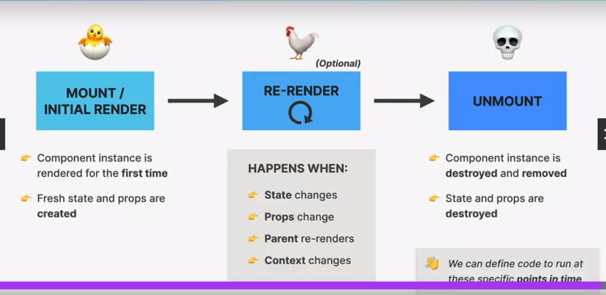

#### What is React ?

React is a Javascript library for building user interfaces. Its is

-   extremely popular
-   Component based
    -   components are the building blocks of user interfaces in React
    -   we build complex uis in react by building and combining different components
    -   A React component can be anything in your web application like a Button, Text, Label, or Grid.
-   Declarative

    -   We describe how components look like and how they work using a declarative syntax called JSX
    -   Declarative: telling react what a component should look like, based on current data/state.
    -   React is abstraction away from DOM: we never touch DOM

    -   JSX: a syntax that combines Html, Css, Javascript as well as referencing other components.

-   State-driven
    -   State is basically data and based on this data react renders the UI
    -   when state/data changes then we manually update the state in app and React automatically re-render the updated ui
    -   React **REACTS** TO STATE CHANGES BY RE-RENDERING THE UI

> #### React is a libraray Beacause React is only the view layer. We still need to pick multiple external libraries to build a complete application.

**While complete frameworks built on top of React are**

-   **NextJs**
-   **Remix**

-   Created in 2011 by Facebook

##### Two ways for setting up a React Project

-   ###### Create-React-App

    -   Complete **'starter kit'** for React application
    -   Everything is already configured: ESLint, Prettier, Jest, e.t.c.
    -   Uses **slow and outdated** technologies (i.e. webpack)

    -   though we can use it for creating projects for practice
        but should **not be used for real-world app** as it's slow and uses outdate technologu on the back

-   ##### Vite

    -   **Modern build tool** that contains a template for setting up React applications.
    -   But need to **manually set up ESLint (and others)**

    -   Used **for modern real-world apps**
    -   **Extremely fast** hot module replacement (HMR) and bundling.

#### Using create-react-app to create a project

`npx create-react-app project_name`

> React started code index.js

```
import React from "react";
import ReactDom from "react-dom/client";

function App() {
  return <h1>Hello React !!!</h1>;
}

const root = ReactDom.createRoot(document.getElementById("root"));
// root.render(<App />);


// StrictMode is a React Developer Tool primarily used for
// highlighting possible problems in a web application.
// In order to identify and detect any problems within the application and
// show warning messages, StrictMode renders every component inside the application twice.

root.render(
    <React.StrictMode>
        <App />
    </React.StrictMode>
)
```

### Components

-   Basic structure :

    -   Data
        -   Props
        -   State
    -   Logic
    -   Appearance

-   React applicatios are entirely made out of components
-   Building blocks of user interfaced in React
-   Piece of UI that has it's own data, logic, and appearance
-   We building coomplex UIs by building multiple components and combining them.
-   Components can be reused, nested inside each other, and pass data between them.

### JSX

-   **Declarative syntax** to **describe** what components **look like** and **how they work**.

-   **Components must return** a block of **JSX**
-   **Extension of JavaScipt that allows us to embed JavaScript, CSS, and React components into HTML.**

-   JSX is converted to javascript using a tool called Babel. it is automatically included in project when creating a project.

    Each JSX element is **converted** to a React.createElement function call.

e,g.

```
<header>
  <h1 style="color: red">Hello React !!!</h1>
</header>

converted to ->

React.createElement(
  'header',
  null,
  React.createElement(
    'h1',
    { style: { color: 'red' } },
    'Hello React!'
  )
);

```

This conversion is needed as browers don't understand JSX syntax.

means we **could use React without JSX**, but this would **mean to write a lot of code.**

### JSX is Declarative

First let's see what **_imperative_** means.

-   Imperative (How to do things)

    -   Manual DOM element selection and DOM traversing
    -   step-by-step DOM mautation until we reach the desired UI

-   Declarative (What we want)
    -   Decribe what UI should look like using JSX, based on current data
    -   React is an abstraction away from DOM: we never touch the DOM.

### Props

-   **Way to pass data** between components specifically from a parent component to a child component.

-   With props, **parent components control** how **child components** look and work

-   **Anything** can be passed as props: single values, arrays, objects, functions, even other components

e.g, let's pass data from _menu_ component to _pizza_ component.

```
function Menu() {
    return (
        <div className="menu">
            <h2>Menu</h2>
            <Pizza />
            <Pizza />
            <Pizza />
            <Pizza />
        </div>
    )
}


function Pizza() {
  return (
    <div>
      </img>
      <h3>Pizza Spinaci</h3>
      <p>Tomato, mozarella, spinach, and ricotta cheese</p>
    </div>
  );
}
```

_passing data_

```
function Menu() {
    return (
        <div className="menu">
            <h2>Menu</h2>
            <Pizza
            photoName="photo/piza.jpg"
            name="Pizza Spinaci"
            ingredients="Tomato. spinach"
            price="10"
            />
        </div>
    )
}

function Pizza(props) {

  console.log(props)
  // Javascript object
  {
    photoName: 'photo/piza.jpg',
    name: 'Pizza Spinaci', ingredients: 'Tomato. spinach',
    price: '10'
  }

  return (
    <div>
      </img>
      <h3>{props.name}</h3>
      <p>{props.ingredients}</p>
    </div>
  );
}
```

#### Props are READ-ONLY !

-   Components Basic structure :
    -   Data
        -   Props
        -   State
    -   Logic
    -   Appearance

Props is data coming from the **outside**, and can **only be updated** by the **parent element**

State is internal data that can be updated by the component's logic

-   Props are read-only, they are **immutable!** This is one of React's strict rules.

-   If you need to mutate props, you actually **need state**

##### Why ?

-   As props are actually JavaScript objects, Mutating props would affect parent, creating **side effects**

-   Components have to be **pure functions** in terms of props and state.
    i.e, component should not manipulate external data
    lie:

    ```
    const x = 7;
    function Fun() {
      x=6; // -> violates components being pure function

      return <h1>hello</h1>
    }
    ```

    -   This allows React to optimize apps, avoid bugs, make apps predictible.

#### ONE-WAY data flow

-   React follows one-way data flow.
-   data can only be passed from parent to child components which is done by props.

-   makes applications more predictable and esier to understand

-   makes applications, easier to debug, as we have more control over the data

-   is more performant.

### RULES OF JSX

-   JSX works essentially like HTML, but we can enter **"JavaScript mode""** by using {} _(for text or attribute)_

-   We can place \*\*JavaScript expressions inside {}.
    Examples: reference variables, create arrays or objects, [].map(), ternary operator

-   Statements are **not allowed** (if/else, for, switch)

-   JSX produces a **JavaScript expression**
    const el = <h1>Hello React !!!</h1>

    _converts to_

    const el = React.craeteElement("h1", null, "Hello React !!!");

    _and vice versa_

    -   We can place **other pieces of JSX** inside {}
    -   We can write JSX **anywhere** inside a component (in if/else, assign to variables, pass it into functions)

-   A piece of JSX can only have **one root element.** If you need more, use <React.fragment> (or the short <>)

#### Difference Between JSX and HTML

-   _className_ instead of HTML's _class_

-   _htmlFor_ instead of HTML's _for_

-   Every tag needs to be closed. Examples:  or <br />

-   All event handlers and other properties need to be **camelCased**. e.g, _onClick_ or _onMouseOver_

-   **Exception**: aria-_ and data-_ are written with dashes like in HTML

-   CSS inline styles are written like this: **{{style}}**
    (to reference a variable, and then an object)

    e.g., `{{color:"red"}}`

-   CSS property names are also **camelCased**

-   Comments need to be in {} (because they are JS)

---

Note:

inside {} we caanot write if/else r forEach because these two don't prodcuces value. Therefore only those javascript are written that propuces a value.

like: array.map(x => x.name) // this returns a modified array therefore is valid.

like wise instead of if/else, we can use:

-   conditionals (&& or ||)
-   ternary

---

### React Fragment

```
{pizzaLength > 0 ? ( -> line 'A'
  <p>
    Authentic Italian cuisine. 6 creative dishes to choose from. All from
    our stone oven, all organic, all delicious
  </p>

  <ul className="pizzas">
    {pizzaData.map((pizza) => (
      <Pizza data={pizza} key={pizza.name} />
    ))}
  </ul>
) : (
  <p>We're still working on our menu. Please come back later :)</p>
    )}
```

In the above line 'A' , the JSX is returning two elements, while we know that a JSX can have only one root element.
S, above will give error.

So, to return more than one root element, we use fragment.

we enclose the elements we want to return in **<> </>**

e.g.,

```
{pizzaLength > 0 ? ( -> line 'A'
  <>
    <p>
      Authentic Italian cuisine. 6 creative dishes to choose from. All from
      our stone oven, all organic, all delicious
    </p>

    <ul className="pizzas">
      {pizzaData.map((pizza) => (
        <Pizza data={pizza} key={pizza.name} />
      ))}
    </ul>
  </>
) : (
  <p>We're still working on our menu. Please come back later :)</p>
    )}

```

Instead of enclosing within <> </>, we can also use <React.Fragment> </React.Fragment>

#### Conditionally setting classNames

`<li className={`pizza ${props.data.soldOut ? 'sold-out' : ''}`}>`

#### Event-listener in React

-   we use `onClick` i.e, inline html attribute

### What is State ?

-   Data that a component **can hold over time**, necessary for information that it needs to remenber throughout the app's life cycle.

-   Used to manage the data inside a component itself.
-   It is both read and write unlike props which is _read-only_

-   **Component's memory**

-   **Component state**: Single local component variable("Piece of state", "state variable")

-   Updating **component state** triggers React tp **re-render the component**

#### How to use State ?

-   Creating a state variable

    -   We use `useState()` function which is imported from React
    -   `const [step, setStep] = useState(1)`
        here 1, is basically the initial value of the state ariable `step` and `setStep` is the function that `useState` gives to update the state

-   To change the state variable `step` we will use `setStep` , like this -> `setStep(step + 1)`

> **useState()** is called **hook** in React.

> all the react function which start with `use` are `hooks`

> we can only call `hooks` like `useEffect()` on the top level of function not inside `if-statement` or inside other function or inside loop.

> We should `only update state variable using the setter function`, not manually.

> When a `state` changes , then react `re-renders` the components which will result in new `updated component view`, **but it preserves the `state` in the process**.

> 👉*React* is called "React" because...
> React **Reacts** to state changes by re-rendering the UI

-   It's better to use callback function when we want to change state based on current state

    e.g.,

    `const [step, setStep] = useState(1);`

    `setStep((s) => s+1);`

-   Each component has and manages `its own state`, no matter how many times we render the same component

-   Multiple instances of the same component are independent of each other

#### Practical Guidelines About State

-   Use a state variable for any data the component should keep track of ("remember") over time. **This is data that will change at some point**

-   Whenever you want something in the component to be **dynamic**, create a piece of state related to that "thing", and update the state when the "thing" should change.

-   When building a component, imagine its view as a **reflection of state changing over time.**

-   For data that should not trigger component re-renders, don't use state. Use a regular variable instead.

#### Global State vs Local State vs Derived State

-   Local State

    -   State needed **only by one or a few components**
    -   State that is defined in a component and **only that components and child components** have access to it(by passing via props)

-   Global State

    -   State that **many component s** might need
    -   **Shared** state that is accessible to **every component** in the entire application

    Achieved using:
    React Context API and
    Redux(external global state management library)

#### Lifting State up

Its possible that two components may require same state, and if there is a parent child relationship between the components then we can pass the state as props to the child.

But if the two components are siblings, then we need to lift the state up, meaning we have to put the state in the first common parent component.

### Controlled Elements

-   By default, the state of the input fields are owned by DOM so its difficult to get their values.

-   So we use controlled elements in react to control the states of input field

-   So controlled elements are basically the elements whose values are defined by the state and it also has an event handler which listens for the change and updates the state accordingly.

##### Derived State
  - State that is computed from an existing piece of state or from props.


### Children Prop

- When we use any component, then instead of closing it immediately, we can use it like any normal html tags like `div` which has both opening and closing tags `<div>` and `</div>`

Now in case of components, the values between the opening and closing are considered as, **children props** that can be passed. And this children props can be accessed in the component using special keyword `children`

```

<Button bgColor="white"
        color="red"
        onClick={onClick}
> 
<span>👉 Next </span> ------> line 1
</Button>

function Button({ bgColor, textColor, onClick, children }) {
    return (
        <button
            style={{ color: textColor, backgroundColor: bgColor }}
            onClick={onClick}
        >
            {children}
        </button>
    );
}

here, in children, line 1 will be passed
```

- The children prop **allow us to pass JSX into an element**
- Essential tool to make **reusable** and **configurable** components
- Really **useful for generic components** that don't know their content before being used.
- It's great to reduce number of props passed

##### Prop Drilling

It's a situation when a state has to be sent through several nested child component so that it could be used in some deeply nested component.

It's solved using component composition.

#### Component Composition
It is combining different components using the **children** prop (or explicitly defined props)

e.g,

```
function Modal() {
  return (
    <div className="modal>
      <Success />
    </div>
  );
}

function Success() {
  return <p>It's done.</p>;
}

The way modal component is structured, it cannot be reused. 
Let's say in the modal I want to display An Error componet, then we cannot do so, as Success component is explicitly defined there. 

We can use the Modal component as the following to make it reusable:

- by children prop

function Modal({children}) {
  return (
    <div className="modal>
      {children}
    </div>
  );
}

<Modal>
  <Success />
<Modal />


- by explicitly defined props

function Modal({anyname}) {
  return (
    <div className="modal>
      {anyname}
    </div>
  );
}

<Modal anyname={<Success />}> />

```

With component composition, we can:
- Create highly reusable and flexible components.
- Fix prop drilling (great for layouts)


### Component vs Instance vs Element


#### Component


- **Description** of a piece of UI
- A component is a function that **returns React elements** (element tree), usually written as JSX
- "Blueprint" or "Template"

#### Instance


- Instances are created when we **"use"** the component.
- Actual **physical manifestation** of a component
- Has its own state and props.
- Has a **lifecycle** (can "be born", "live" and "die")

#### React Element


- A component instance is what returns **React Element**
- JSX is converted to React.createElement() **function calls**
- A React Element is the result of these function calls
- React Element contains the necessary information to create **DOM Elements**

#### DOM Element (HTML)


- Actual **visual representaion** of the component instance in the browser


## How Components are Displayed on the screen ?


### Step 1: Render is Triggered

The two situations that trigger renders:
  1. Initial render of the application
  2. State is updated in one or more component instances (re-render)

- The render process is triggered for the entire application but it doesn't mean that all components are redrawn, because in **React Rendering is only about calling the component function and figuring out what need to change in the DOM later**.

- **In practice**, it looks like React only re-renders the component where the state update happens, but that's not how it **works behind the scenes**

- Renders are **not** triggered immediately, but **scheduled** when the JS engine has some "free time". There is also batching of multiple setSate calls in event handlers.


### Step 2: Render Phase

#### Initial Render


  Take the entire component tree and create it into a React Element tree , which is also called **Virtual DOM**. 

  **Vitual DOM:** Tree of all React elements created from all instances in the component tree. It is bascially representation of a UI which is kept in memory and synced with the "Real" DOM, and this process is called **Reconciliation**.

- Cheap and fast to create multiple trees as virtual DOM is just a javascript object.


Now let's say, there is a state update in component D (in the above photo), this will trigger re-render, which means React will call the function of Component D and place the new React element in the new React element tree(Virtual DOM).

    Rendering a component will cause all of its child components to be rendered as well (no matter if props changed or not)
  
  The above action is necessary, because React doesn't know whether the children will be affected. But this doesn't mean that entire DOM is updated, its just the Virtual DOM that will be re-created.


The new virtual DOM that was created after the state update will now get **Reconciled** with the **Fiber Tree** (as it existesd before state update)

This reconcilation of the fiber tree is done by the **React's Reconciler** which is called **Fiber**.

The **result** of this **reconciliation** process will be an **updated Fiber Tree** that will eventually be **used to write to the DOM**

**Why need Reconciliation ?**
**Why not update the entire DOM whenever state changes somewhere in the app ?**

Entire DOM is not updates because that would be inefficient and wasteful as:
- Writing to the DOM is (relatively) **slow**
- Unsually only a **small part of the DOM** needs to be updated and the rest remains the same.

Whenever a render is triggered, React **reuses** as musch of the **existing DOM** as possible.

The above resuing part is done in Reconciliation process.

**Reconciliation:** Deciding which DOM elements actually need to be inserted, deleted, or updated, in order to reflect the latest state changes

#### The Reconciler: FIBER


In the initial render, Fiber takes the entire React Element Tree(virtual DOM) and creates a Fiber Tree.

**Fiber Tree:** 
- internal tree that has a "fiber" for each component instance and DOM element.

- Fibers are **NOT** re-created on every render
Fiber just mutates in the future reconciliation steps.
This is what make Fibers a perfect place to keep track of the current component state, props, list of used hooks and more.

Each Fiber also contains a queue of work to do. Like updating state, updating ref, performing DOM update that's why Fiber is also defined as unit of work.

The elemnts in Fiber tree are arranged in a different way as compared to React element tree.

Fiber tree has a **structure** of a **linked list**.
Here, each first child has link to it's parent and all the other children has link to it's previous sibling.
It makes it easier to process the work associated with each Fiber.

The work can be done **asynchronously** 
Rendering process can be split into chunks, taks can be prioritized, and work can be **paused**, **resused**, or **thrown away**.

This asynchronous rendering:
- enables **concurrent feature** like Sspense or transitions
- Long renders  **won't block** JS engine

and this all is only possible because the render state doesn't produce any visible output to the DOM yet.

#### Reconciliation in ACTION


Let's understand with the xample in photo.

Initially the showModal = true, now when the state changes to false, it will: trigger re-render, which will then create a new virtual DOM.


Now, the new Vitual DOM needs to be Reconciled with the current Fiber Tree which will then result in updated Fiber Tree  which internally is called **workInProgress Tree**

Whenever reconciliation needs to happen, Fiber wals the entire tree step-by-step and analyses exactly what needs to be changed between the current Fiber Tree and the  Updated Fiber Tree based on new Virtual DOM.

This process of comparing elements step-by-step based on their position in the tree is called **Diffing**

In the updated Fiber Tree:


Btn - this component is marked as **DOM update** as it's text needs to be changed to "hide"

and the components : **Modal, Overlay, h3 and button,** are **marked** for **DOM Deletion** as they are no longer present in the new updated DOM.

and in case of Video component, it got re-renderd as it's a child of App component but it didn't change so DOM won't get updated in this case.

Now, once this process is over, all these DOM mutations will be place in a list called **list of effects**. Which will be used in next phase called Commit Phase to actually mutate the DOM.

It means till now React still not had written anything to DOM yet, but it has figured out what all changes needs to be made based on the list of effects.


RENDER PHASE *gave* **LIST OF DOM UPDATES**

### Step 3: COMMIT Phase


- **React writes to the DOM:** insertions, deletions, and updates ( list of DOM updates are "flushed" to the DOM )

- **Committing is synchronous:** DOM is updates in one go, it can't be interrupted. This is necessary so that the DOM never shows partial results, ensureing a consistent UI.

- After the commit phase completes, the *workInProgress* fiber tree becomes the current tree **for the next render cycle**

**Writing to the DOM**, is the **wor**k of a separate library called **ReactDOM.**

> React does **not** touch the DOM. React **only renders**. It doesn't know where the render result will go.

Step 4: Browser Paints the updated DOM


### How Diffing works ?

Diffing uses 2 fundamental assumptions (rules) : 
- Two elements of different types will **produce different trees**
- Elements with a stable key prop stay the same across renders

>This allows React to go from 1,000,000,000 [O(n^3)]to 1000 [O(n)] operations per 1000 element

1. Same Position, Different Element


- React assumes entire subtree is no longer valid.
- Old components are destroyed and removed from DOM, including state.
- Tree might be rebuilt if children stayed the same (state is reset)

2. Same Position, Same Element


- Element will be kept (as well as child elements), including state.
- New props/ attributes are passed if they changed between renders. **important**
- Sometimes this is not what we want. Then we can use the key prop.


### Key Prop

- Special prop which tells the diffing algorithm that an element is **unique.**

- Allows React to **distinguish** between multiple instances of the same component type

- When a key **stays the same across renders**, the element will be kept in the DOM (even if the position in the tree changes)

  - keys in the list items

- When a key **changes between renders**, the element will be destroyed and a new one will be created ( even if the position in the tree is the same as before )

  - Key prop to reset state ( changing key )


## Reconciliation vs Diffing

In React, reconciliation and "diffing" are terms often used in the context of the virtual DOM and the process of updating the actual DOM based on changes in the virtual DOM. Let's explore each concept:

### Reconciliation:

**Definition:** 
Reconciliation is the process of updating the actual DOM to match the virtual DOM efficiently. It involves comparing the new virtual DOM tree with the previous one and determining the minimum number of changes needed to update the actual DOM.

**Purpose:** 
The goal of reconciliation is to optimize the rendering process by minimizing the number of updates to the DOM. React aims to make these updates as efficient as possible to improve performance.

**Algorithm:**
 React uses a diffing algorithm during the reconciliation process to identify the differences between the new and old virtual DOM trees. The algorithm then generates a minimal set of instructions for updating the actual DOM.


### Diffing:

**Definition:**
Diffing, short for "difference algorithm," is the specific algorithm used during reconciliation to compare two virtual DOM trees and identify the changes between them.

**Process:** 
The diffing process involves comparing nodes in the old and new virtual DOM trees and determining whether an update is needed. React's algorithm, often referred to as the "Virtual DOM Diffing Algorithm," is responsible for efficiently identifying the minimum set of changes required to update the DOM.

**Efficiency:** 
React's diffing algorithm is designed to be efficient, taking advantage of heuristics and optimizations to minimize the time and resources required for the reconciliation process.

In summary, reconciliation is the broader process of updating the actual DOM based on changes in the virtual DOM, and diffing is the specific algorithm used within reconciliation to identify the differences between the old and new virtual DOM trees. React's diffing algorithm plays a crucial role in making this process efficient, helping to deliver optimal performance in updating the UI.


### How state updates are **BATCHED ?**

When the state is changes using useState(), then newly updated state is not immediately available to us. It's available only after the re-render.


Let's say we are changing 3 states in our handler function, then it doesn't mean that react will re-render the component 3 times. Instead, these state upates get batched, and a single re-render and commit is done by react per event handler.


React 18, provides automatic batching functionality.
 
Before React 18, automatic batching inside timeouts, promises and native event caller(el.addEventListener()) didn't happen. But this was overcome in React 18.

- This state updating is asynchronous.

- We can **opt out** of automatic batching by wrapping a state update in ReactDOM.flushSync()


```
function handler() {
  setLike(like + 1);
  setLike(like + 1);
  setLike(like + 1);
}
```

the above function tries to increase the like 3 times, but it won't happen as the update like value is not available immediately.

So, here we need to change the state based on the current state value. That's why we use callback function to update state (like below).

```
function handler() {
  setLike((like) => like + 1);
  setLike((like) => like + 1);
  setLike((like) => like + 1);
}
```

here, in the callback function we get the access to updated like value.


### Framework vs Library


#### Framework

- 👍 Everything we need to build a complete application is **included** in the framework

- 👎 You are stuck with the frameworks tools and conventions (which is not always bad)

- Vue, Angular

#### Library

- 👍 You can **choose multiple 3rd party library** to build a complete application.

- 👎 You need to **research, download, learn and stay-up-to-date** with multiple external libraries.

- React

#### React 3rd party library Ecosystem


#### Frameworks built on top of React

- NextJs, Remix, Gatsby


### Summary of Above


## Effects and Data Fetching

### Component Lifecycle




#### Side effect:
It is basically an *"interaction between a React component and the world outside the component".* We can also think of a side as *"Code that actually does something".* **Examples:** Data fetching, setting up subscriptions, setting up timers, manually accessing the DOM, etc.

We need side effects all the time. They make our applications do something. **Not** in render logic!

- Can be made in:
  - Event handlers (onClick, onSubmit, etc)
  - Effects (allows us to write code that will run at **different moments:** mount, re-render, or un-mount)


### useEffect hook

Many times it's required to fetch some data from an api as soon as the component is rendered.
But, we can't provide the fecth logic in the render ogic of the component as it will create an infinite re-rendering of the component (side effect).

So, we use useEffect hook, which is used to run certain function at different parts of component lifecycle i.e, at the initial render, on re-render or when the component un-mounts/removed.

e.g., useEffect to make an api call after the component has rendered.

```
  function App() {
    const [movies, setMovies] = useState([]);

    useEffect(functon () {
      fetch('https://apicall.com')
      .then((res) => res.json())
      .then((data => setMovies(data)));
    }, []);

    // the second argument of the useEffect is called the dependency list. Here, it's an empty list, it means, the effect will run only on the first mount/when the app component renders for the very first time.
  }
```

### Effects vs Event Handlers


*Using async function in effect*
effect function that we put inside useEffect() cannot return promise. 
So, we need to define another function inside the effect function, which will then return promise.

```
  function App() {
    const [movies, setMovies] = useState([]);

    useEffect(functon () {
      async function fetchMovie() {
          const res = await fetch('https://apicall.com')
          const data = await res.json();

          setMovies(data);
      }
      fetchMovie();
    }, []);
  }

```

### What's the useEffect Dependency array ?

- By default, effects run **after every render**. we can prevent that by passing a dependency array.

- Without the dependency array, React doesn't know **when** to run the effect.

- **Each time one of the dependencies changes, the effect will be executed again**.

- **Every state variable and prop used in the effect must be included in the dependency array**


**Effects are executed after the browser has painted the component instance.**


### cleanup functions in useEfect

- Function that we can **return from an effect**(optional)

- Runs on two occasions:
  - Before the effect is **executed again** in order to clear the results of previous side effect
  - After a component has **unmounted**

cleanup function can be used in case like:
when we are making http request in effect. 
If the component re-renders while the first request is still running then a new second request will be fired off, which might create a bug called race condition. 

Therfore its a good idea to cancel the request in a clean up function whenever the component re-renders or unmounts.


----------------------------------

## React Hooks

- Special built-in functions that allow us to **"hook" into React internals:**
  - Creating and accessing state from Fiber tree
  - Registering **side effects** in Fiber tree
  - Manual **DOM Selection**
  - Many more...

- Always start with **"use"** (useEffect, useState, etc.)
- Enable easy **reusing of non visual logic:** we can compose multiple hooks into our own **custom hooks**

- Give **function components** the ability to own state and run side effects at different lifecycle points ( before v16.8 only available in class **components**)

Some built-in hooks:
- useState
- useEffect
- useReducer
- useContext
- useRef
- useCallback
- useMemo
- useTransition
- useDeferredValue

### Rules of hooks:
1. **Only call hooks at the top level**
  - D **NOT** call hooks inside **conditionals, loops, nested functions,** or after an **early return**
  - This is necessary to ensure that hooks are always called in the **same order**

2. **Only call hooks from React functions**
  - Only call hooks inside a **function component** or a **custom hook**

*Note: These rules are **automatically enforced by** React's ESLint rules*


#### There are two ways to initialize state in useState hook

- const [name, setName] = useState(0) -> passing the value in the hook
- passing function inside the hook 
  - it's done when the state needs value based on some computation
  const [name, setName] = useState(function() {
    return localStorage.getItem('name');
  })


### useRef hook

- It let's you reference a value that's not needed for rendering
- It's basically an object which has **mutable** property that is **persisted across renders**

- Two big use cases:
  1. **Creating a variable thats stays the same between renders**(***e.g.previous state, setTimeout, etc.***)
  2. **Selecting and storing the DOM element**

- Refs are for **data that is NOT rendered:** usually only appear in event handlers or effects, not in JSX (otherwise use state)

- Do **NOT** read write in render logic(like state)

- Calue of ref is accessed using `.current`


#### Similarities between Refs and State

- Both persists the data across renders

#### Difference between Refs and State

- Re-renders
  - State: updating state causes re-render
  - Ref: updating ref do not causes re-render

- Mutablity
  - State: immutable
  - Refs: mutable

- Asynchronous
  - State: updates are asynchronous, so we cannot use new state just after the update
  - Refs: update is synchronous, so we can use the new ref just after the update

Examples:

1. *Using ref to count number of re-renders*

    If we tried to count how many times our application renders using the useState Hook, we would be caught in an infinite loop since this Hook itself causes a re-render.

    ```
    const [inputValue, setInputValue] = useState("");
      const count = useRef(0);

      useEffect(() => {
        count.current = count.current + 1;
      });
    ```

2. *Using ref to focus an input element*

    ```
    function Search() {
      const inputEl = useref(null);

      useEffect(function() {
        inputEl.current.focus();
      }, []);

      return <input className="search"
              ref={inputEl}> 
    }
    ```

### Custom Hooks

- A resuable function which uses one or more react hooks
- Allows us to reuse **non-visual logic** in multiple components
- One custom hook should have **one purpose**, to make it **resuable** and **portable** (even across multiple projects)
- Function name needs to start with `use`

- Unlike components, can receive and return **any relevant data**

  


## useReducer Hook
```
const [count, dispatch] = useReducer(reducer, 0);
```

- it takes two values: 
  1. a reducer function
  2. initial state (here 0)

reducer(): this function takes two arguments **state** and **action**
  - state is the initial state
  - action is the value which we will use to modify the state

```
function reducer(state, action) {
  console.log(state, action) // comment
  return state + action;
}
```

count: stores the state value

dispatch: used to change the state

**dispatch(2):**
this will call the reducer function, and whatever the function returns, will be set as the new state.

**the line 1163:** will give output as 0, 2
and the new state will be 0+2 = 2

### Why useReducer ?

State Management With useState is not enough in certain situations:

1. When components have **a lot of state variables and state updates,** spread across many event handlers **all over the component**

2. When **multiple state updates** need to happen **at the same time** (as a reaction to the same event, like "starting a game")

3. When updating one piece of state **depends on one or multiple other pieces of state**

**In all these situations, useReducer Can be of great help**

### Managing state with useReducer


- An alternative way of setting state, ideal for **complex state** and **related pieces of state**

- Stores related pieces of state in a **state** object

- useReducer needs **reducer:** function containing **all logic to update state. *Decouples state logic from component***

- **reducer:** pure function (**no side effects**) that takes current state and action, **and returns the next state**

- **action:** object that describes **how to update state** (contains *type* and *payload* type: shows what type of state update , 
payload: is the value to be used to update state
**type and payload are standard naming convention, but can be named anything**
)

- **dispatch:** function to trigger state updates, by **"sending" actions** from **event handlers** to the **reducer**

### Analogy to understand useReducer


---

### Setting up react project using vite

1. Create project
   - `npm create vite@latest`
2. Setup eslint
   - Vite doesn't configure eslint for us. We have to do it manually.
   - `npm install eslint vite-plugin-eslint eslint-config-react-app --save-dev`
3. Create file .eslintrc.json and add some rules
   - `{
        "extends": "react-app"
     }`
     This will make eslint to use rules predefines in the package we installed
4. Configure vite.config.js file
    - Add eslint plugin to the plugins array

      `import eslint from 'vite-plugin-eslint`

      `plugins: [react(), eslint()]`

---

### Routing

- With routing, we match **different urls** to **different UI views** (React components): **routes**

- This enables users to **navigate between different applications screens**, using the browser url

- Keeps the UI **in sync** with the current browser URL

- Allows us to build **single page applications(SPA)**

> **ReactRouter -> 3rd party library used for Routing**
> `npm i react-router-dom`

---

### <u>Single-Page Applications (SPA)</u>

- Application that is **executed entirely on the client (browsers)**

- **Routes:** different URLs correspond to different views (components)

- **Javascript** is used to update the page (DOM)
- **The page is never reloaded** as based on url a componet is rendered.
- This functionality gives a feel of a **native app**


#### <u>SPA Running on client</u>

1. User clicks router link
2. Url is changed this result in re-render
3. DOM is updated: React component corresponding to the new URL is rendered.

---
Adding Router to the Application

```
import {BrowserRouter, Routes, Route} from 'react-router-dom';

function App() {
  return (
    <>
      <h1>React Router</h1>

      <BrowserRouter>
        <Routes>
          <Route path="/" element={<Home />} />
          <Route path="product" element={<Product />} />
          <Route path="About" element={<About />} />
        </Routes>
      </BrowserRouter>
    </>
  )
}

```
*Here, h1 tag will be on every page. And the element whose route matches the url will be rendered.*


